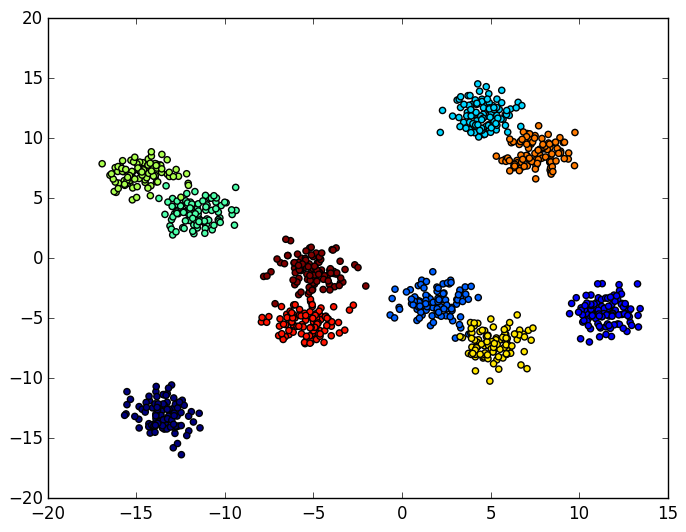
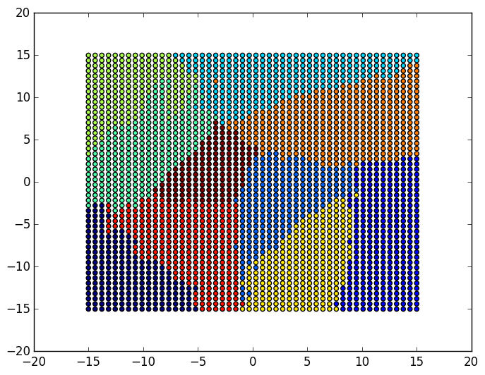
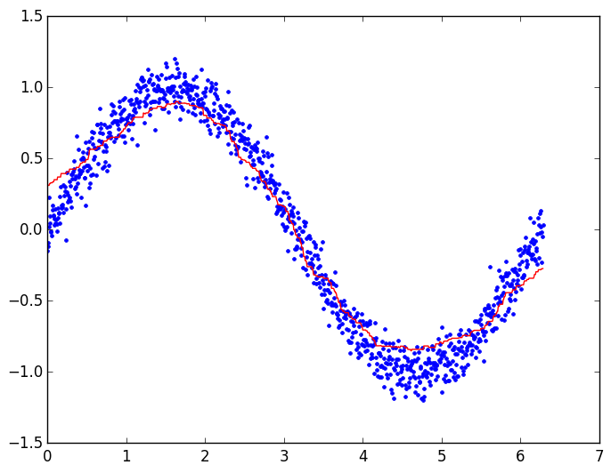
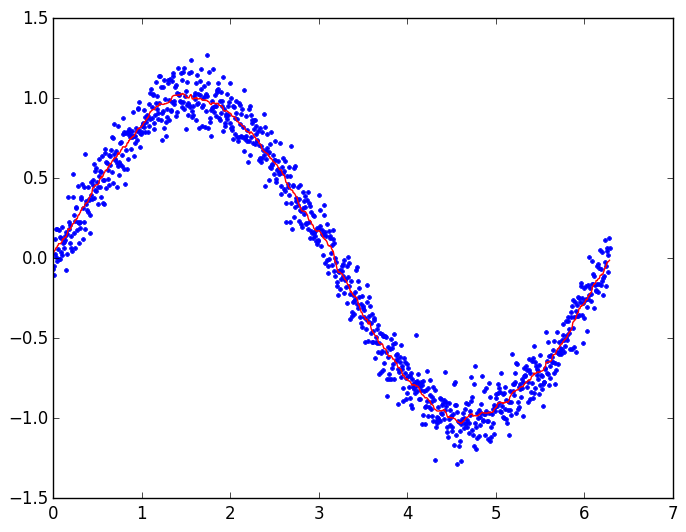

# RandomFerns

[](https://travis-ci.org/rened/RandomFerns.jl)
[](http://pkg.julialang.org/?pkg=RandomFerns&ver=0.4)
[](http://pkg.julialang.org/?pkg=RandomFerns&ver=0.5)


This package provides an implementation of the very fast Random Ferns classifier / regressor as described in M. Özuysal et al., "Fast Keypoint Recognition in 10 Lines of Code", CVPR 2007.

#### Usage

For classification:

```jl
using RandomFerns
rf = RandFerns(data, labels)            # data ... D x N, labels ... 1 x N
prediction = predict(rf, testdata)      # testdata ... D x M, prediction ... 1 x M
```

Training data: 


Learnt classification boundaries:


For this example, training takes about 25ms, and prediction 36ms.

For regression:

```jl
using RandomFerns
rf = RandFerns(data, targets, regression = true)
                                        # data ... D x N, targets ... T x N
prediction = predict(rf, testdata)      # testdata ... D x M, prediction ... T x M
```

Notice the typical over-smoothing behavior, due to the simplicity of the model:



Due to the fact that the cells are stored in a sparse fashion, it is possible to use a very high number of splits (240), which e.g. in this case yields a much better result:




#### Parameters

```jl
RandFerns(data, targets; regression = false, nsplits = 10, nferns = 32)
```
`RandFerns` has the following parameters:
* `regression` - set to true for regression
* `nsplits` - how many splits in feature space, yielding `2^nsplits` cells
* `nfers`- how many ferns to train

